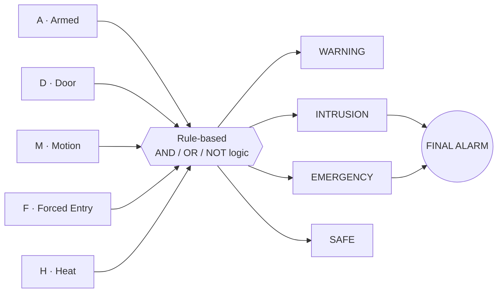

# 🏠 Smart Home Security System — Digital Design & Circuit Analysis

**One-Zone Rule-Based Security Classification, designed and simulated in Logisim**

A digital-logic circuit that combines an *armed* state with four sensor inputs (door, motion, forced entry, heat) and classifies the situation as **Safe**, **Warning**, **Intrusion**, or **Emergency**, then derives a **Final Alarm** output.


---

## 📖 Table of Contents

- [Overview](#-overview)
- [Problem Statement](#-problem-statement)
- [Objectives](#-objectives)
- [System Design](#-system-design)
- [Boolean Equations](#-boolean-equations)
- [Truth Table (Representative Cases)](#-truth-table-representative-cases)
- [Circuit Implementation](#-circuit-implementation)
- [How to Run](#-how-to-run)
- [Repository Structure](#-repository-structure)
- [Limitations & Scope](#-limitations--scope)
- [Future Work](#-future-work)
- [References](#-references)
- [Team](#-team)

---

## 🔎 Overview

A single sensor firing is often ambiguous. An open door can be routine; motion alone doesn't explain itself; forced entry and dangerous heat are entirely different kinds of threat. Instead of "sensor triggered → alarm", this project asks:

| Question | Signals |
|---|---|
| What happened? | Door / Motion / Forced Entry / Heat |
| What is the system state? | Armed or Disarmed |
| How serious is it? | Safe / Warning / Intrusion / Emergency |

The "smart" part is the **rule-based interpretation of combined inputs**. It is not AI or machine learning.

```
Sensors → System state → Conditions → Situation → Alarm
```

## ❗ Problem Statement

A basic "any sensor → immediate alarm" rule loses context:

- A door opening can be normal activity, not necessarily an intrusion.
- Motion alone does not always explain why the motion occurred.
- Forced entry and dangerous heat represent different kinds of threats.
- Treating every event identically discards useful information.

## 🎯 Objectives

1. **Model one security zone** — armed state plus four sensor inputs as binary signals.
2. **Classify situations** — distinguish Safe, Warning, Intrusion, and Emergency.
3. **Use multi-condition logic** — combine sensor states rather than treating every trigger the same.
4. **Implement digitally** — translate the rules into Boolean logic and gates in Logisim.
5. **Validate behavior** — test representative input combinations and verify the outputs.
6. **Stay extensible** — show how the zone logic could be replicated for multiple zones.

## 🧩 System Design

### Inputs

| Signal | Name | Meaning (1 = active) |
|:---:|---|---|
| `A` | Armed | System is armed |
| `D` | Door | Door is open |
| `M` | Motion | Motion detected |
| `F` | Forced Entry | Forced-entry sensor triggered |
| `H` | Heat | Dangerous heat detected |

### Outputs

| Output | Meaning |
|---|---|
| `SAFE` | No active threat |
| `WARNING` | Relevant event, but not yet an intrusion |
| `INTRUSION` | Strong evidence of unauthorized entry |
| `EMERGENCY` | Heat-related emergency |
| `ALARM` | Final alarm, derived from the higher-severity states |

### Block Diagram



### Decision Paths

| Path | Condition |
|---|---|
| Warning | Armed **and** (door, motion, or forced entry) **and** not already an intrusion |
| Intrusion | Armed **and** (door **and** motion) |
| Intrusion | Armed **and** forced entry |
| Emergency | Heat condition |

## 🧮 Boolean Equations

Derived from the gate network in `project.circ`:

```
INTRUSION = A · ( (D · M) + F )
WARNING   = A · ( D + M + F ) · INTRUSION'
EMERGENCY = H
SAFE      = ( WARNING + INTRUSION + EMERGENCY )'
ALARM     = INTRUSION + EMERGENCY
```

Notes:

- `SAFE` is the exact complement of "any other state is active".
- `WARNING` and `INTRUSION` are mutually exclusive by construction (`INTRUSION'` gates the warning path).
- `EMERGENCY` depends only on `H`, so it triggers **whether or not the system is armed**.
- The circuit is **deterministic**: the same input combination always gives the same classification.

## 📊 Truth Table (Representative Cases)

| Case | A | D | M | F | H | SAFE | WARNING | INTRUSION | EMERGENCY | ALARM |
|---|:-:|:-:|:-:|:-:|:-:|:-:|:-:|:-:|:-:|:-:|
| Normal / idle | 0 | 0 | 0 | 0 | 0 | 1 | 0 | 0 | 0 | 0 |
| Door open while armed | 1 | 1 | 0 | 0 | 0 | 0 | 1 | 0 | 0 | 0 |
| Door + motion while armed | 1 | 1 | 1 | 0 | 0 | 0 | 0 | 1 | 0 | 1 |
| Forced entry while armed | 1 | 0 | 0 | 1 | 0 | 0 | 0 | 1 | 0 | 1 |
| Heat while armed | 1 | 0 | 0 | 0 | 1 | 0 | 0 | 0 | 1 | 1 |
| Disarmed activity (door + motion) | 0 | 1 | 1 | 0 | 0 | 1 | 0 | 0 | 0 | 0 |

## 🔧 Circuit Implementation

The design lives in a single `main` circuit built only from basic gates:

- **5 input pins** — `A`, `D`, `M`, `F`, `H`
- **5 output pins** — `SAFE`, `WARNING`, `INTRUSION`, `EMERGENCY`, `ALARM`
- **Gates** — 3× AND, 3× OR, 2× NOT (no sub-circuits, no memory elements)

> 📸 **Add your screenshot here:**
> ``

### Methodology

1. Define inputs (Armed, Door, Motion, Forced Entry, Heat)
2. Define states (Safe, Warning, Intrusion, Emergency)
3. Write rules mapping input combinations to states
4. Translate the rules into Boolean logic (AND / OR / NOT)
5. Build the gate network in Logisim for one security zone
6. Test representative scenarios and edge cases

## ▶️ How to Run

1. Install [Logisim](http://www.cburch.com/logisim/) (the file was saved with version **2.7.1**; Logisim Evolution can usually open it too).
2. Clone this repository:
   ```bash
   git clone https://github.com/<your-username>/<your-repo>.git
   cd <your-repo>
   ```
3. Open `project.circ` in Logisim.
4. Select the **Poke Tool** and click the input pins to toggle them between `0` and `1`.
5. Watch the output pins change and compare them with the truth table above.

## 📁 Repository Structure

```
.
├── project.circ                                       # Logisim circuit (implementation)
├── Smart_Home_Security_System_Digital_Design_1.pptx   # Project presentation
├── docs/
│   └── circuit.png                                    # (add) circuit screenshot
└── README.md
```

## ⚠️ Limitations & Scope

This is a small, first-year digital-logic project. It is **not**:

- AI or machine learning
- An IoT or phone-connected system
- A physical sensor / hardware implementation
- A new commercial security technology

It models **one zone** with binary inputs and purely combinational logic.

## 🚀 Future Work

- Replicate the zone logic to build a **multi-zone** system with a combined status.
- Add a latch / memory element so an alarm stays on until reset.
- Add entry/exit delay timers for the armed state.
- Wrap the logic in a reusable Logisim sub-circuit.
- Re-implement in Verilog/VHDL and test on an FPGA.

## 📚 References

1. M. Morris Mano & Michael D. Ciletti, *Digital Design: With an Introduction to the Verilog HDL*.
2. Thomas L. Floyd, *Digital Fundamentals*.
3. Introductory material on intrusion detection, alarm systems, and sensor fusion.

## 👥 Team

| Name | Roll Number |
|---|---|
| Sai Sahasra | 2620030388 |
| Varshitha | 2620030386 |
| Harsha | 2620030432 |

---

*Course project — Digital Design & Circuit Analysis.*
